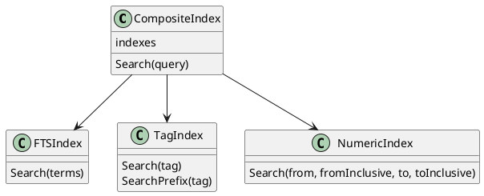
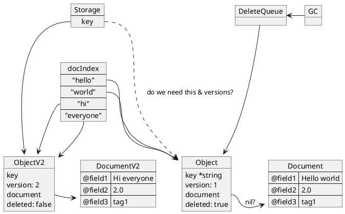
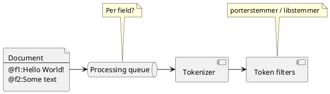

# Secondary indexes for ElastiCache

```plantuml
@startuml 
class CompositeIndex {
    indexes
    Search(query)
}

class FTSIndex {
    Search(terms)
}

class TagIndex {
    Search(tag)
    SearchPrefix(tag)
}

class NumericIndex {
    Search(from, fromInclusive, to, toInclusive)
}

CompositeIndex --> FTSIndex
CompositeIndex --> TagIndex
CompositeIndex --> NumericIndex
@enduml
```

```plantuml
map Document {
    @field1 => Hello world
    @field2 => 2.0
    @field3 => tag1
}

map Storage {
    key *-> Document
}
```

```plantuml
@startuml versioned

map Document {
    @field1 => Hello world
    @field2 => 2.0
    @field3 => tag1
}

map DocumentV2 {
    @field1 => Hi everyone
    @field2 => 2.0
    @field3 => tag1
}

object Object {
    key *string
    version: 1
    document
    deleted: true
}

Object::document -> Document : nil?

object ObjectV2 {
    key
    version: 2
    document
    deleted: false
}

ObjectV2::document -> DocumentV2

map Storage {
    key *--> ObjectV2
}

Storage::key ...> Object : do we need this & versions?

map docIndex {
    "hello" *--> Object
    "world" *--> Object
    "hi" *--> ObjectV2
    "everyone" *--> ObjectV2
}

object DeleteQueue
DeleteQueue ---> Object

object GC
GC -left-> DeleteQueue


@enduml
```

```plantuml
@startuml Full text search
allowmixing

file d [
    Document
    ---
    @f1:Hello World!
    @f2:Some text
]

queue "Processing queue" as pq
note top : Per field?

component "Tokenizer" as t

component "Token filters" as tf
note top : porterstemmer / libstemmer


d -> pq
pq -> t
t -> tf

@enduml
```
